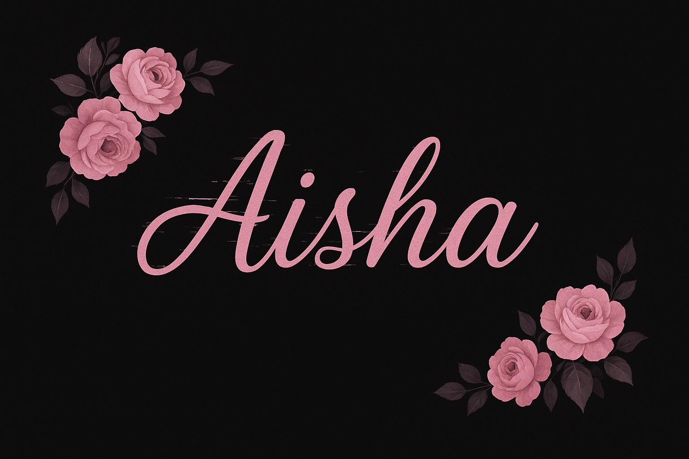

<!-- 🌸 My Improved GitHub Profile 🌸 -->

<!--

  

-->
### 🩷 Hey there, I'm Sydney Aisha

<h3 align="center">🌸 Welcome to my world of code 🌙</h3>
<!-- <h4 align="center"><i>✨ the intersection between creativity and code ✨</i></h4> -->

  <em>💻 Computer Science Student | 🌷 Aspiring AI Engineer | ☕ Tech & Aesthetic Lover</em>

  

### 🖤 About Me  
🌸 I’m a second-year Computer Science student passionate about **AI, Machine Learning, and Web Development**.  
🌙 I love blending creativity with code- building things that look as good as they work.  
☕ Fueled by caffeine, lo-fi beats, and dreams that glow in pink and black.  
✨ I believe in coding with heart and aesthetics 💕  

  

### 💻 Tech Stack ⚙️

  

  

### 🌸 Currently  
- 🌱 Learning **AI & Machine Learning**  
- 💻 Building projects in **Python**, **Flutter** and **Java**  
- 🧠 Expanding my knowledge in **Internet Application Programming**  
- 🎯 Leveling up my coding & aesthetic game

  

### 🌙 GitHub Stats  

  
  

  

### 💌 Connect With Me  

  

  
<i>Let’s connect and create something beautiful 💌</i>

  
  <!--
  
-->
  

 

  

 
 

### 🌷 Quote I Love  
> “Code like a girl. Think like a queen.” 👑  

 

✨ Made with love & caffeine ☕ by <strong style="color:#ffb6c1;">Aisha</strong> 🌸

